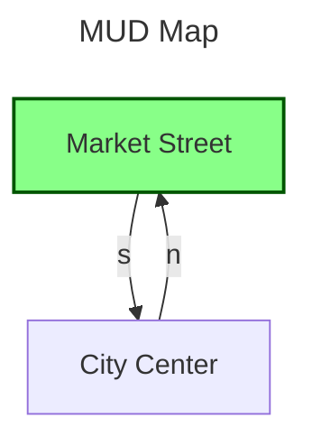

# Gotin Mapping System

This document outlines the internal workings and user-facing features of the Gotin mapping system. Gotin uses a powerful hybrid mapping approach that allows for both manual graph construction and smart auto-mapping, visualizing the result directly in your terminal using [Mermaid](https://mermaid.js.org/) syntax.

## 1. Overview

The mapping system is designed to keep track of where you are in the MUD, how rooms connect to each other, and present a visual graph of your surroundings. 

### Key Features
- **In-Memory Graph**: Fast, bidirectional room traversal.
- **Smart Auto-Mapping**: Hashes room descriptions to uniquely identify rooms, even if their names are identical (e.g., "A Dark Forest").
- **Mermaid Visuals**: Leverages `go-mermaid` to generate flowchart representations of the map that can be rendered or exported easily.
- **JSON Persistence**: Maps are saved to disk as human-readable JSON files.

---

## 2. How Rooms Are Stored

Internally, the map is a directed graph. 

### The `Room` Struct
Each room is stored as an object containing:
- **`ID`**: A unique UUID generated upon room creation.
- **`Name`**: The user-friendly or auto-detected name of the room.
- **`Description`**: A snippet of the room's description used for identification.
- **`DescriptionHash`**: A SHA-256 hash of the room's description and known exits. This is the core of the auto-mapping system, allowing the client to recognize when you've walked in a circle or returned to a previously visited room.
- **`Exits`**: A map linking standard directions (n, s, e, w, u, d, etc.) to the `ID`s of other rooms.
- **`X, Y, Z`**: Logical coordinates. While the map is fundamentally a node graph, these coordinates help in standardizing the map layout.

### The JSON File
When you run `/map exit` or the game triggers an auto-save, the engine serializes the `Map` object (which contains the `Rooms` dictionary and the `CurrentRoom` ID) to a JSON file (e.g., `map.json`).

---

## 3. How Mermaid Graphs Are Generated

When you invoke the `/map mermaid` command, the mapping engine translates the internal graph of rooms into a **Mermaid Flowchart** (`flowchart TB`).

1. **Breadth-First Search (BFS)**: Starting from your `CurrentRoom`, the engine branches out via known exits up to a specified `radius` (default is 3). If you specify `all`, it skips the BFS and grabs every room in the dictionary.
2. **Node Creation**: For every room found in the search radius, a Mermaid `Node` is created. The node label is set to the room's `Name`.
3. **Styling the Current Room**: To ensure you know where you are, the node matching your `CurrentRoom` ID is injected with a custom green style (`fill:#8f8,stroke:#050`).
4. **Link Creation**: The engine iterates through the `Exits` of the visible rooms, creating labeled directional arrows (`-->|n|`) pointing to the connected room nodes. 
5. **Output**: The raw Mermaid markdown block is sent to the terminal window. (If your terminal or markdown viewer supports Mermaid, it will render as a beautiful diagram!).

---

## 4. Comprehensive User Manual

The `/map` command acts as the central hub for all mapping activities. Below is a comprehensive guide to using the system.

### Initializing & Session Management

- `/map create [filename]`
  Initializes a new map in memory. If a filename (like `world.json`) is provided, it will load it if it exists, or create it if it doesn't.
  *Example: `/map create midgaard.json`*

- `/map exit`
  Stops auto-mapping, saves the current map to disk, and exits the mapping mode.
  *Example: `/map exit`*

### Manual Mapping Commands

If you prefer building the map node-by-node, or need to fix auto-mapping errors:

- `/map name <room_name>`
  Renames the room you are currently standing in.
  *Example: `/map name The Town Square`*

- `/map dig <direction> <room_name>`
  Creates a brand new room in the specified direction, links the current room to it, and automatically moves your focus to the new room.
  *Example: `/map dig n Temple Altar`*

- `/map link <direction> <room_id_or_name>`
  Creates a one-way exit from your current room to an existing room. Useful for setting up teleports or one-way drops.
  *Example: `/map link d The Sewers`*

- `/map teleport <room_id_or_name>`
  Teleports your internal map focus to another room without actually sending movement commands to the MUD.
  *Example: `/map teleport Town Square`*

- `/map delete <room_id_or_name>`
  Deletes a room from the graph and automatically severs any links pointing to it.
  *Example: `/map delete 8a2f-49c...`*

- `/map undo`
  Reverts the last structural change made to the map (digs, links, deletions).

### Visualizing the Map

- `/map show`
  Toggles the live, terminal-native map pane to the right of the MUD output.
  Cell pitch (2,2). Layer auto-switches on up/down/in/out. Pan with h/j/k/l
  while the input line is empty; `c` recenters; `[`/`]` step layers; `Esc`
  closes.

- `/map mermaid [radius|all]`
  Generates the Mermaid graph.
  *Example: `/map mermaid`* (Shows rooms up to 3 steps away)
  *Example: `/map mermaid 5`* (Shows rooms up to 5 steps away)
  *Example: `/map mermaid all`* (Renders the entire world map)

- `/map info`
  Displays raw developer data for the current room, including its unique ID, Description Hash, and raw exit mappings.

- `/map search <query>`
  Searches the entire map for rooms whose names or descriptions match the query, returning their IDs and Names.
  *Example: `/map search Bank`*

### Smart Auto-Mapping

Auto-mapping relies on reading the MUD's text output to intelligently build the map as you walk.

- `/map start [room_id_or_name]`
  Engages auto-mapping mode. As you type directions (n, s, e, w) and the MUD sends back descriptions, the engine will automatically hash the descriptions and link rooms together.
  *Example: `/map start`*

- `/map stop`
  Temporarily pauses auto-mapping.
  *Example: `/map stop`*

---

## 5. Quick Start Example

Here is how you might map your first area upon logging into a MUD:

```text
> /map create my_world.json
(Client: Initializing map...)

> /map name "City Center"
(Client: Room named City Center)

> /map start
(Client: Auto-mapping enabled)

> n
You walk north.
Market Street
This is a bustling market street.
Exits: [North, South]

(Client automatically detects the new room, names it, and links it south back to City Center)

> /map mermaid
```

This will produce the following Mermaid graph in your terminal:


